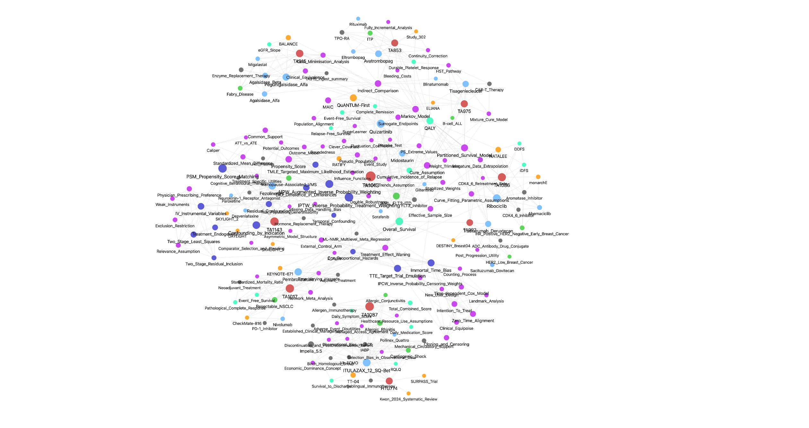
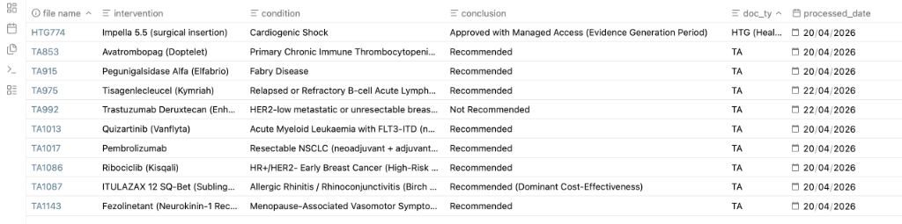

# 🧠 HTA Methodology Wiki: An LLM-Native Strategic Intelligence Hub

> **"Knowledge should not be re-derived on every query; it should be compiled into a persistent, compounding codebase."**

---

> [!IMPORTANT]
> **Portfolio Showcase Notice:** This directory is a curated **static demonstration** of the system's output. It is designed to showcase the methodology, structural logic, and high-fidelity synthesis results. **Downloading this folder will not provide a functional "Live Wiki" engine**, as the underlying LLM-native automation scripts and full private datasets are not included in this public repository.

---

## 🌌 The Knowledge Landscape

Every technical decision in an economic model—from a survival distribution choice to a utility decrement—is a potential battlefield. I visualize these interdependencies through an LLM-augmented **Knowledge Graph**.

*Figure 1: High-dimensional relationship map linking Clinical Endpoints, Statistical Methodologies, and NICE Committee Decision Pillars.*

---

## 🚀 The Philosophy: Knowledge as Code

Unlike traditional RAG (Retrieval-Augmented Generation) systems that "rediscover" knowledge from scratch every time, this Wiki functions as a **Compounding Artifact**.

* **Persistent Synthesis**: Every new NICE case ingested doesn't just add a file; it updates and refines existing "Atomic Nodes" (Drugs, Methods, HTA Concepts).
* **The LLM as Maintainer**: Following a rigorous **Source Fidelity Protocol**, the LLM acts as a "compression and cross-referencing engine," ensuring every claim is traceable back to official NICE/ERG documentation.
* **Obsidian as IDE**: The folder structure serves as the codebase, while markdown provides the transparency needed for forensic HEOR auditing.

---

## 📂 System Architecture: Atomic Node Design

The Wiki is built on the principle of **"One Concept = One Node"**. This prevents information silos and enables cross-case pattern recognition.

### 1. [Case Audit Storyboards](./Case_Audit_Storyboards/)

**Forensic Reconstruction**: Detailed 3-way reconciliation tables comparing **Company Submissions** vs. **ERG/EAG Critiques** vs. **Final Committee Resolutions**.

*Figure 2: Automated case tracker showing the breadth of appraisals ingested (Oncology, Rare Diseases, and Medical Technologies).*

* *Strategic Value:* Identifies the specific "breaking points" where committees override manufacturer assumptions.

### 2. [Technical Method Cards](./Technical_Method_Cards/)

**Statistical Rigor**: Atomic nodes for methods like **IPTW, TMLE, and Recursive Hazard Chaining**.

* *Innovation:* These aren't just definitions; they record **"EAG Challenge Patterns"**—the recurring technical objections raised by NICE assessors across different therapeutic areas.

### 3. [Knowledge Automation (DevOps)](./Knowledge_Automation/)

**Professional Workflow**: Maintaining a production-grade knowledge graph requires more than just notes; it requires code.

* **`compile_wiki.py`**: The core automation engine of the hub. It performs three critical functions:
    1. **Incremental Metadata Management**: Automatically parses and updates the master HTA mapping table (`notebook_map.md`) to track the processing status of every NICE Technology Appraisal.
    2. **Change Detection**: Scans the `/raw` directory for source document updates, flagging "Incremental Update Tasks" to ensure the Wiki nodes remain aligned with the latest evidence.
    3. **Source Integrity**: Ensures every markdown node is properly indexed and traceable to its original TA source, maintaining an audit trail required for HTA submissions.

---

## 🎯 Strategic Utility: Anticipatory Intelligence

The ultimate goal of this Wiki is to provide **Preventive Modelling Guidance**. By synthesising the "Committee Judgment Tendencies" across 20+ oncology cases, the system generates pre-submission checklists:

* **Pre-empting EAG Challenges**: Before a model is built, the Wiki identifies which assumptions (e.g., cure fractions, treatment waning) are most likely to be attacked, based on historical precedents.
* **Case-to-Model Bridge**: This Wiki provided the methodological foundation for the **[RRMM Forensic Audit Project](../01_Oncology_PartSM_Audit/)**, specifically the implementation of the *Hazard Chaining* algorithm.

---

## 🛡️ Operational Standards

* **Source Fidelity**: Zero-tolerance for AI hallucinations. Every entry includes a `Source Anchor` linking to the raw source text.
* **NICE Alignment**: Fully mapped to **DSU TSDs** and the **2022 RWE Framework**.

---
**Lead Architect:** Xiaoge Zhang, PhD (York)  
**Methodology:** LLM-augmented Forensic Auditing  
**Portfolio Hub:** [xgzhang.com](http://xgzhang.com)
