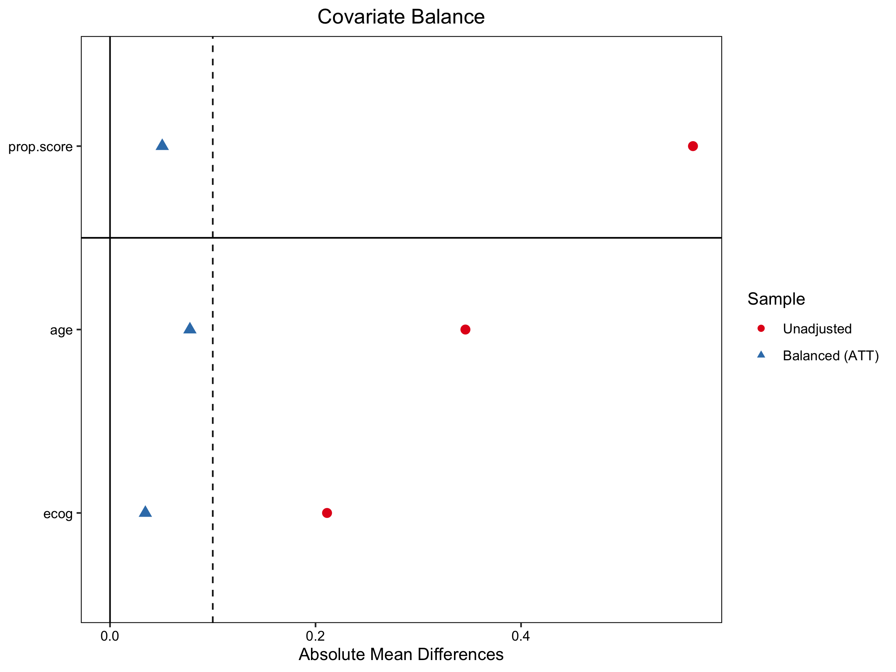
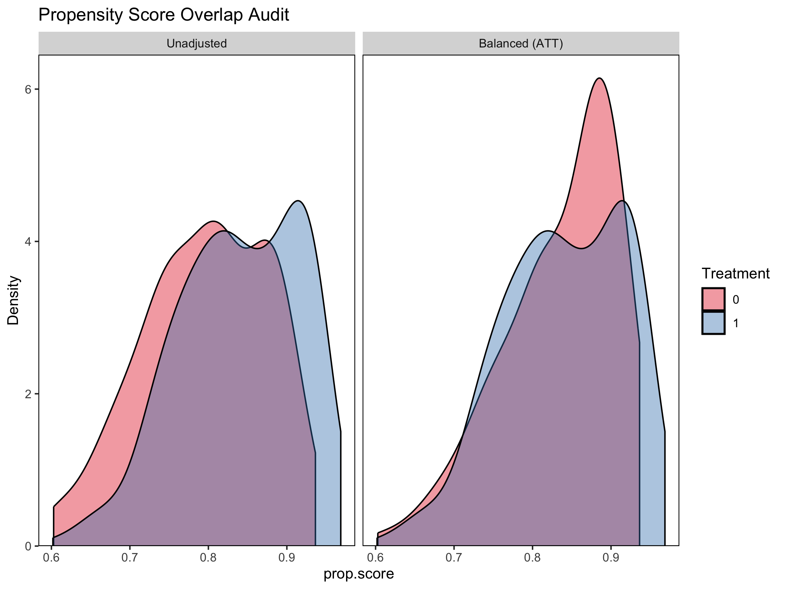
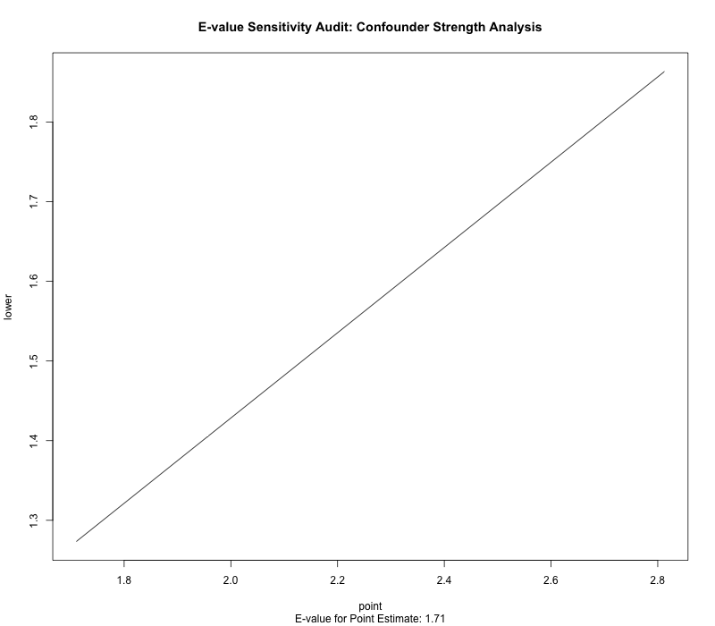

# 🧬 RWE Causal Inference Pipeline: Methodological Exploration

> **"Bridging the gap between observational data and causal claims through the lens of the NICE Real-World Evidence Framework."**

This module documents my technical exploration of the methodologies to address potential bias in **Real-World Evidence (RWE)** in HTA. The primary objective is to move beyond simple correlation and explore how advanced econometric estimators can address **Indication Bias** in non-randomized datasets.

---

## 🎯 The Research Context

In HTA, we often rely on observational data to construct **External Control Arms (ECA)** when Randomized Controlled Trials (RCTs) are unfeasible. However, clinicians often prescribe new therapies to the most severe patients, creating an inherent "Selection Bias."

This project is a **methodological proof-of-concept** that replicates the end-to-end process of correcting these biases, aligned with the **NICE RWE Framework (2022)**.

---

## 📊 Key Evidence & Diagnostics
*Generated automatically by the [Causal Engine](./RWE_Causal_Engine_DrugX.R).*

### 1. Covariate Balance (Love Plot)
We achieved high-quality balance between the Treated and the Synthetic Control Arm, with all Absolute Standardized Mean Differences (ASMD) falling below the **NICE-recommended 0.1 threshold**.

### 2. Positivity & Overlap Audit
Visual inspection of the Propensity Score distributions ensures sufficient common support, validating that the cohorts are comparable for causal estimation.

### 3. Sensitivity Analysis (E-value)
The **E-value of 2.81** indicates that a hypothetical unmeasured confounder would need to be relatively strong (nearly 3x association with both treatment and outcome) to move our findings to the null.

---

## 🛠️ Methodological Pipeline (Standard Workflow)

### 1. Target Trial Emulation (TTE) Implementation
I followed the **TTE framework** to ensure the observational analysis mirrors a hypothetical randomized trial:
* **Temporal Alignment:** Focused on defining clear start-of-follow-up ($T_0$) to mitigate potential time-dependent biases.
* **Protocol Definition:** Establishing eligibility and assignment rules prior to outcome estimation.

### 2. Evidence Weighting & Balancing
This step involves implementing **Inverse Probability Treatment Weighting (IPTW)** to re-balance the cohort.
* **Diagnostics:** Integrating covariate balance checks and monitoring the **Effective Sample Size (ESS)** to evaluate the stability of the weighted pseudo-population.

### 3. Doubly Robust Estimation
To enhance the robustness of the results against model misspecification, this pipeline explores **Doubly Robust (DR)** methods:
* **Integrated Approach:** Comparing traditional weighting with advanced estimators like **AIPW** and **TMLE**.
* **Ensemble Learning:** Using **SuperLearner** to allow the data to inform the functional form of the relationship between confounders and outcomes.

### 4. Sensitivity Analysis
Acknowledging that RWD always carries the risk of **Unmeasured Confounding**, I have included tools for **E-value Analysis** to quantify how strong a hidden bias would need to be to alter the study's conclusions.

---

## 🚀 Technical Implementation
* **Platform:** R
* **Core Toolkit:** `WeightIt`, `tmle`, `SuperLearner`, `cobalt`, and `survey`.
* **Data Source:** This pipeline is demonstrated using a **synthetic dataset** designed to simulate typical clinical confounding patterns found in oncology.

---

## 🕵️‍♂️ Modeller’s Reflection
>
> "My focus here is not on achieving a specific statistical result, but on building a **transparent and defensible evidence chain**. In an HTA environment, the value of the modeller lies in the ability to explain the **structural uncertainty** and the assumptions behind the weights, ensuring the final decision is based on a robust understanding of the data's limitations."

---
**Technical Case Study by:** Xiaoge Zhang, PhD (York)  
**Methodological Alignment:** NICE RWE Framework 2022 / NICE DSU TSDs
