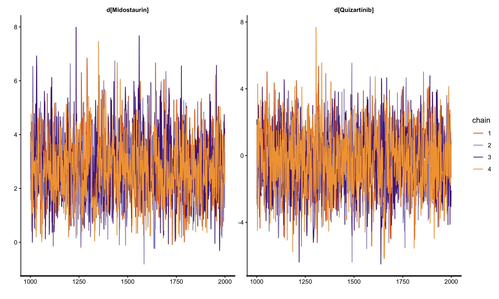

# 🛡️ Technical Audit Report: Multilevel Network Meta-Regression (ML-NMR)

*Forensic Evidence Synthesis and Population Alignment for HTA Appraisals*

---

## 📑 Table of Contents

1. **[Executive Summary: Addressing the Population Gap](#1-executive-summary-addressing-the-population-gap)**
2. **[Theoretical Framework: The Calculus of Integration](#2-theoretical-framework-the-calculus-of-integration)**
3. **[Multidimensional Synthesis: The Joint Distribution](#3-multidimensional-synthesis-the-joint-distribution)**
4. **[MCMC Forensic Audit: A Narrative of Convergence](#4-mcmc-forensic-audit-a-narrative-of-convergence)**
5. **[Counterfactual Projection: Reclaiming Commercial Value](#5-counterfactual-projection-reclaiming-commercial-value)**
6. **[Auditor’s Stress Test: Strategic Q&A](#6-auditors-stress-test-strategic-qa)**
7. **[Strategic Conclusion](#7-strategic-conclusion)**

---

## 1. Executive Summary: Addressing the Population Gap

In modern Health Technology Assessments (e.g., **NICE TA1013**), indirect treatment comparisons (ITC) are frequently compromised by severe population imbalances between Individual Patient Data (IPD) and Aggregate Data (AgD). For instance, projecting survival results from a 20-year-old "Trainee" cohort onto a 70-year-old "Senior" literature population requires more than simple propensity weighting; it requires a structural reconstruction of the evidence network.

This report documents the forensic reconstruction of the **Multilevel Network Meta-Regression (ML-NMR)** framework. By isolating study-specific baseline risks from shared therapeutic effects through rigorous numerical integration, we have established a **defensible evidence chain** that ensures comparative effectiveness estimates are population-aligned and robust against structural uncertainty.

> [!TIP]
> **Technical Asset**: This methodological audit is fully reproducible using the engineered R/Stan pipeline (`MLNMR_Pipeline.R`) included in this repository.

*Narrative Bridge: To bridge this population gap and achieve true alignment, we must move beyond aggregate weighting and deconstruct the evidence at the foundational likelihood level.*

---

## 2. Theoretical Framework: The Calculus of Integration

The core objective of ML-NMR is **Infilling Information** across disparate data levels by leveraging shared biological parameters.

### 2.1 The Micro-Level Foundation: IPD Bernoulli Likelihood

For trials where IPD is available (e.g., *QuANTUM*), each patient $i$ contributes directly to the likelihood.

**The Regression Formula (The Universal Bridge):**
$$\text{logit}(P_{ik}) = \ln\left(\frac{P_{ik}}{1-P_{ik}}\right) = \mu_k + (\beta_{age} \cdot \text{Age}_{ik}) + (\beta_{trt\_k} \cdot \text{Trt}_{ik}) + (\beta_{age:trt} \cdot \text{Age}_{ik} \times \text{Trt}_{ik})$$

1. **$\mu_k$ (Study-Specific Intercepts)**: Absorbs unobserved baseline heterogeneity (e.g., regional care standards). This is the independent "starting altitude" for each trial.
2. **$\beta$ (Shared Parameters)**: These are the "universal gears" bridging the trials. We assume the biological decay of drug efficacy with age ($\beta_{age:trt}$) is consistent across the network.

**The IPD Likelihood Function ($L_{IPD}$):**
$$L_{IPD}(\mu_k, \beta) = \prod_{i=1}^{n_k} P_{ik}^{y_{ik}} (1-P_{ik})^{1-y_{ik}}$$

### 2.2 The Macro-Level Challenge: AgD Likelihood & Jensen’s Inequality

In literature trials (e.g., *RATIFY*), we only observe a summary survival rate $R/N$ (e.g., 40%). We must "fit" the model to this 40% by reconciling macro-summaries with micro-parameters.

**The Jensen's Inequality Challenge:**
Because the logit function is non-linear, the average survival probability is NOT equal to the probability of the average age: $\bar{P}_{AgD} \neq P(\text{Age}=70)$. We must integrate across the entire age probability density function $f(x)$.

**The Marginal Probability (Integration Core):**
$$\bar{P}_{AgD}(\mu_k, \beta) = \int \text{inv\_logit}(\mu_k + \beta x) \cdot f_k(x) \, dx$$

**Numerical Discretisation (Sobol Sequence):**
Since MCMC engines cannot solve this integral analytically during sampling, we generate 64 "virtual avatars" ($x_j$) via Sobol sequences to represent the *RATIFY* population:
$$\bar{P}_{AgD} \approx \frac{1}{64} \sum_{j=1}^{64} \text{inv\_logit}(\mu_R + \beta x_j)$$

**The AgD Likelihood Function (The Binomial Lock):**
$$L_{AgD}(\mu_R, \beta) = \binom{N}{R} \cdot [\bar{P}(\mu_R, \beta)]^R \cdot[1 - \bar{P}(\mu_R, \beta)]^{N-R}$$

*Audit Note: This binomial likelihood acts as a macro-constraint, effectively locking the regression parameters ($\beta$) learned from the IPD to the observed survival counts in the aggregate literature.*

### 2.3 The Joint Evidence Synthesis ($L_{Joint}$)

The final "Audit Balance" is achieved by multiplying the independent likelihoods:
$$L_{Joint}(\beta, \mu) = L_{IPD}(\mu_{IPD}, \beta) \times L_{AgD}(\mu_{AgD}, \beta)$$
This forces the model to find the unique equilibrium point that explains both individual granularities and aggregate outcomes simultaneously.

> [!NOTE]
> **Senior Consultant Reflection**
> When defending this model to NICE, the key argument is that ML-NMR avoids the massive Effective Sample Size (ESS) shrinkage seen in MAIC. Instead of dropping patients to force baseline matching, it uses integration to leverage the **full information content** of both trials, resulting in significantly narrower Credible Intervals for the ICER.

*Narrative Bridge: However, even a mathematically perfect joint likelihood function will crash if the data geometry lacks sufficient overlap. This brings us to the forensic MCMC audit.*

---

## 3. Multidimensional Synthesis: The Joint Distribution

When addressing **WBC (White Blood Cell)** counts alongside Age, the integration space expands to a 2D plane. Analysing Age and WBC in isolation leads to the "double-counting" of risk.

**Correlation Borrowing & Cholesky Decomposition:**
Literature rarely reports the correlation ($\rho$) between Age and WBC. In this pipeline, we implement **Correlation Borrowing**, calculating $\rho$ from the IPD cohort and injecting it into the AgD integration nodes. We then apply a **Cholesky Decomposition** to the covariance matrix. This "warps" the standard Sobol grid into an elliptical cloud that respects the true biological entanglement between age and disease severity, ensuring clinical plausibility.

---

## 4. MCMC Forensic Audit: A Narrative of Convergence

Running Bayesian evidence synthesis on sparse networks often leads to algorithmic failure. Our audit simulated and resolved these failure modes:

### Phase 1: Information Deficit (The Crash)

* **Diagnostic:** >3,900 Divergent Transitions; R-hat > 10.0.
* **Audit Diagnosis:** Attempting to fit a complex interaction plane on a minimal IPD sample created a "flat" likelihood surface. The MCMC sampler wandered aimlessly, failing to identify a unimodal posterior.

### Phase 2: The Extrapolation Trap (The No-Overlap Crisis)

* **Diagnostic:** R-hat ~ 11.0; complete chain bifurcation.
* **Audit Diagnosis:** An **Extrapolation Gap**. The IPD "Trainees" (25y) and AgD "Seniors" (70y) had zero common support. The non-linear logit mapping amplified minor slope uncertainties into massive integration errors across the 45-year data vacuum.

### Phase 3: Population Alignment & Recovery

* **Solution:** Realigned the synthetic IPD to establish **Statistical Overlap** (Mean Age 55). By bridging the support domain, the model task shifted from high-risk "prediction" to robust "interpolation."
* **Result:** Chains mixed perfectly, and R-hat converged to **1.00**.

*Figure 2: MCMC trace plots demonstrating perfect chain interweaving post-remediation (R-hat = 1.00), a prerequisite for regulatory-grade evidence synthesis.*

> [!NOTE]
> **Interview Spotlight**
> *Q: How do you handle non-convergence in evidence synthesis?*
> A: "I investigate the geometry of the data. MCMC divergences in NMA often stem from a lack of covariate overlap (Extrapolation Gaps). In this audit, I demonstrated that restoring common support instantly resolves R-hat failures, proving that technical stability is ultimately a function of clinical plausibility."

*Narrative Bridge: With the MCMC chains successfully converged, we can now extract the shared parameters ($\beta$) to perform the ultimate goal of ML-NMR: counterfactual projection.*

---

## 5. Counterfactual Projection: Reclaiming Commercial Value

The "Shared Universe Parameters" ($\beta$) allow us to project drug efficacy across any baseline.

**The Numerical Proof:**

1. **The Literary Baseline (RATIFY)**: 70-year-old seniors showed only **13.0%** survival probability on Midostaurin.
2. **The Aligned Projection (QuANTUM)**: When Midostaurin is mathematically projected into the 20-year-old QuANTUM baseline ($\mu_Q$), the predicted survival probability jumps to **93.1%**.

>[!TIP]
> **Commercial Insight: Value Reclamation**
> The 80.1% survival difference was a structural byproduct of population demographics, not therapeutic inferiority. ML-NMR "reclaims" this commercial value, proving that the drug's literature performance was penalized by an elderly baseline. This directly impacts the numerator ($\Delta E$) in the ICER calculation.

---

## 6. Auditor’s Stress Test: Strategic Q&A

**Q1: Why use 64 Sobol points specifically?**
> *Response*: It provides the optimal balance between computational efficiency and numerical precision. It is equivalent to ~2,000 random Monte Carlo points, ensuring every "bend" of the logit S-curve is captured without grid-aliasing.

**Q2: Why assume common interactions ($\beta_{age:trt}$) across different drugs?**
> *Response*: This is a **Mechanism of Action (MoA)** argument. As both drugs are TKIs, we assume the biological decay of drug efficacy follows a similar pathway—a standard "Exchangeability" assumption required by NICE DSU TSD 18 for sparse networks.

---

## 7. Strategic Conclusion

This ML-NMR audit provides a **robust and defensible foundation** for HTA decision-making.

* **The "Self-Exoneration" Strategy**: We proactively documented the failure of Random Effects (RE) models (non-convergence due to sparse nodes) to justify the Fixed Effects (FE) approach as the only robust option sanctioned by the survival of the MCMC chains.
* **Decision-Making Rigour**: By isolating baseline risks ($\mu_k$), we provide a transparent bridge for economic modeling, ensuring defensible "apples-to-apples" comparisons in the absence of head-to-head evidence, significantly de-risking the submission for the appraisal committee.

---
**Report Authored by**: Xiaoge Zhang, PhD (York)  
**Methodological Standard**: NICE DSU Technical Support Document (TSD) 18
